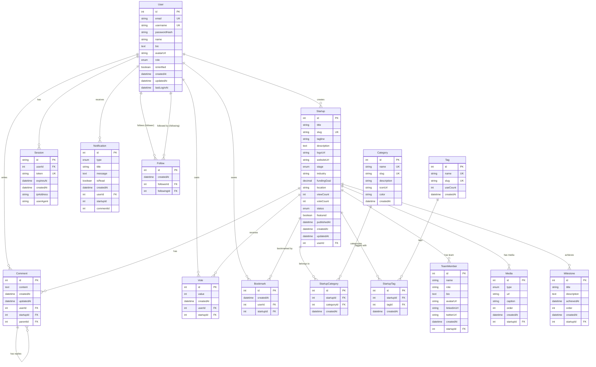

# Entity-Relationship Diagram

## Visual Database Schema

## Key Relationships

### One-to-Many
- User → Startup (one user creates many startups)
- User → Comment (one user writes many comments)
- User → Vote (one user casts many votes)
- User → Bookmark (one user saves many bookmarks)
- User → Session (one user has many sessions)
- User → Notification (one user receives many notifications)
- Startup → Comment (one startup has many comments)
- Startup → Vote (one startup receives many votes)
- Startup → Bookmark (one startup bookmarked by many users)
- Startup → TeamMember (one startup has many team members)
- Startup → Media (one startup has many media files)
- Startup → Milestone (one startup achieves many milestones)
- Comment → Comment (one comment has many replies - self-referencing)

### Many-to-Many (via Junction Tables)
- Startup ↔ Category (via StartupCategory)
- Startup ↔ Tag (via StartupTag)
- User ↔ User (via Follow - self-referencing)

### Unique Constraints
- User: email, username
- Startup: slug
- Category: name, slug
- Tag: name, slug
- Session: token
- StartupCategory: (startupId, categoryId) composite
- StartupTag: (startupId, tagId) composite
- Vote: (userId, startupId) composite
- Bookmark: (userId, startupId) composite
- Follow: (followerId, followingId) composite

### Cascade Delete Rules
All foreign key relationships use `ON DELETE CASCADE`:
- Deleting a User removes all their Startups, Comments, Votes, Sessions, etc.
- Deleting a Startup removes all associated Comments, Votes, TeamMembers, Media, etc.
- Deleting a parent Comment removes all reply Comments

## Enums

### UserRole
- USER
- ADMIN
- MODERATOR

### StartupStage
- IDEA
- MVP
- BETA
- LAUNCHED
- GROWTH
- SCALING

### StartupStatus
- DRAFT
- PUBLISHED
- ARCHIVED
- REJECTED

### MediaType
- IMAGE
- VIDEO
- DOCUMENT

### NotificationType
- NEW_COMMENT
- NEW_VOTE
- NEW_FOLLOWER
- STARTUP_PUBLISHED
- STARTUP_FEATURED
- MENTION
- SYSTEM

## Index Strategy

### High-Priority Indexes (Already Defined)
- User: email, username, createdAt
- Startup: userId, slug, status, publishedAt, createdAt, featured, industry
- Category: slug
- Tag: slug, useCount
- StartupCategory: startupId, categoryId
- StartupTag: startupId, tagId
- Comment: userId, startupId, parentId, createdAt
- Vote: userId, startupId
- Bookmark: userId, startupId
- Follow: followerId, followingId
- TeamMember: startupId
- Media: startupId, order
- Milestone: startupId, order
- Session: userId, token, expiresAt
- Notification: userId, isRead, createdAt

### Composite Indexes (Future Optimization)
If query performance requires, consider adding:
- `(status, publishedAt)` on Startup for published startup feeds
- `(userId, createdAt)` on Startup for user's startup history
- `(industry, featured)` on Startup for featured industry listings
- `(isRead, createdAt)` on Notification for unread notification queries
